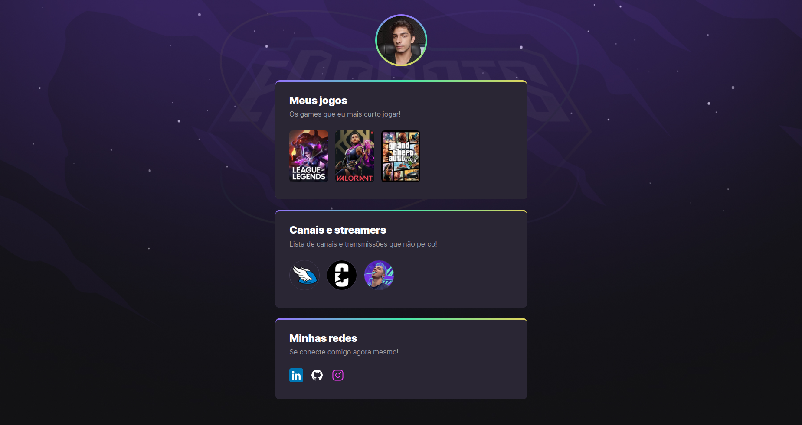

# Projeto NLW eSports

> Trilha Explorer

Projeto construido no evento Next Level Week da Rocketseat

[Clique aqui para acessar](https://guilherme-freschi.github.io/Projeto-nlw/)

## Tecnologias Utilizadas

- HTML
- CSS
- Git e GitHub

## O que aprendi

O projeto foi muito importante para a revisão de conceitos em HTML e CSS, além da fixação e conhecimento de boas práticas na estruturação do projeto.

## Contato

guilherme.ciesco@gmail.com